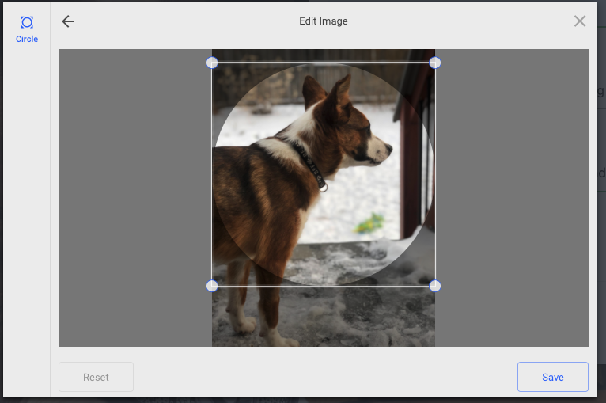
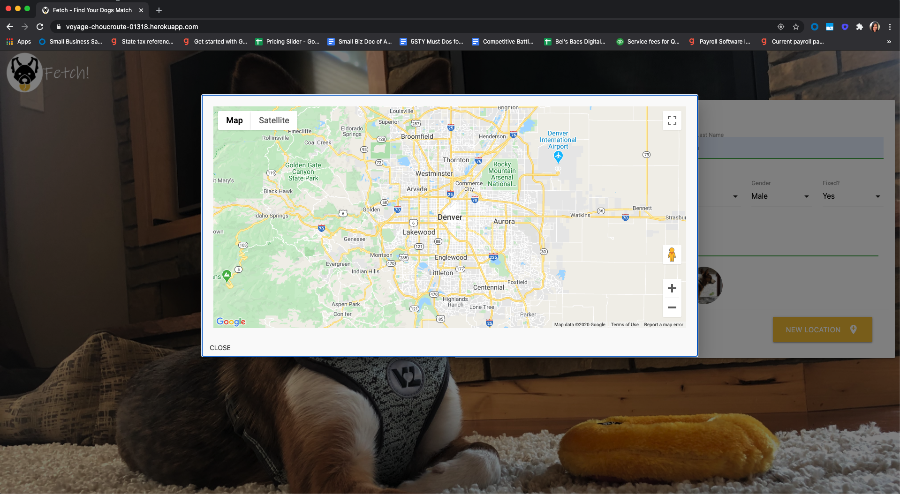
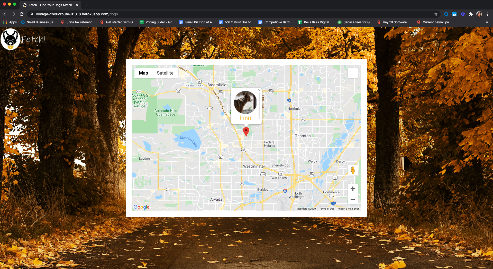
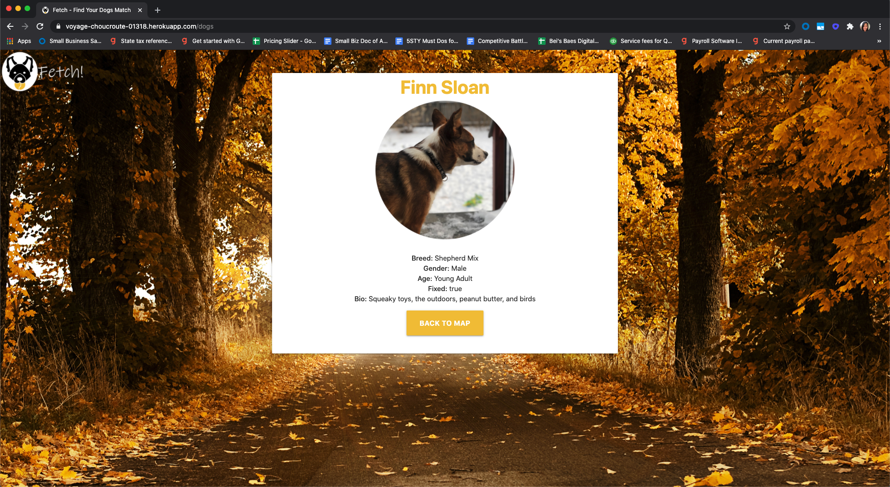

# Fetch-Project-2
Fetch! A Dating App for Dogs! -- Project 2 for DU Coding Bootcamp
## Getting Started
Link to heroku deployment: https://voyage-choucroute-01318.herokuapp.com/

## Team Members
* Sammy Sloan (@slsloan)
* Will Hitch (@willhitch)
* Calvin Gillam (@cgillam)
* Paul Fidika (@PaulFidika)

## Project Description
### Overview 
For project two we were tasked at building an app using the MVC paradigm and our own server-side API. We decided on a dog dating app where you could add new dogs to a database and then view the dog's data on a map generated by the GoogleMaps API.
```
AS A dog owner with a lonely dog
I WANT find other single dogs within my area 
SO THAT I can have a new friend for my dog 
```






### Technology/Framework:
* HTML / CSS / JAVASCRIPT
* jQuery / AJAX
* NPM / express / MySQL / sequelize / dotenv / nodemon / express-handlebars
* Materialize (https://materilizecss.com/)
* Heroku / JAWSDB

### API Reference: 
* Google Maps (https://developers.google.com/maps/documentation/javascript/tutorial)
* FileStack (https://www.filestack.com/docs/)

## Acknowledgments
* Logo created by Billy Bernard 
